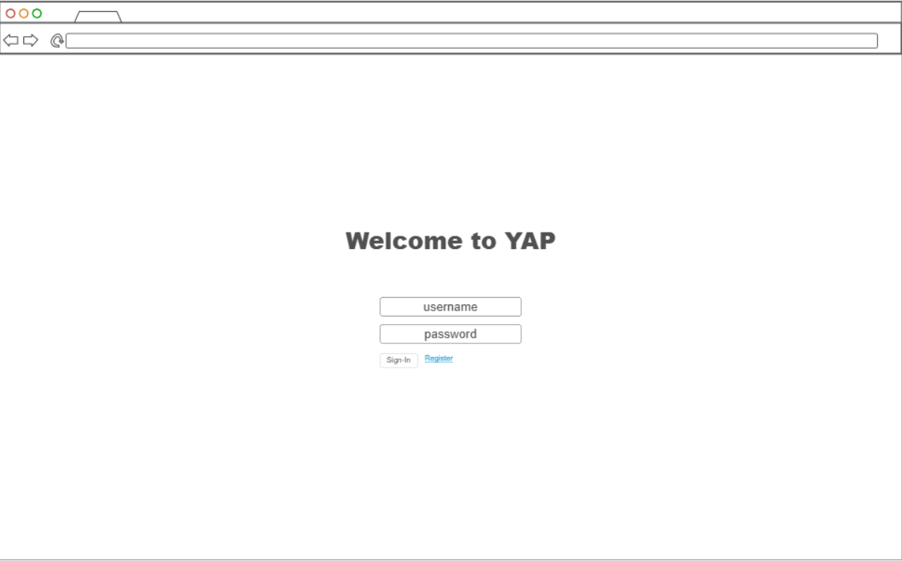
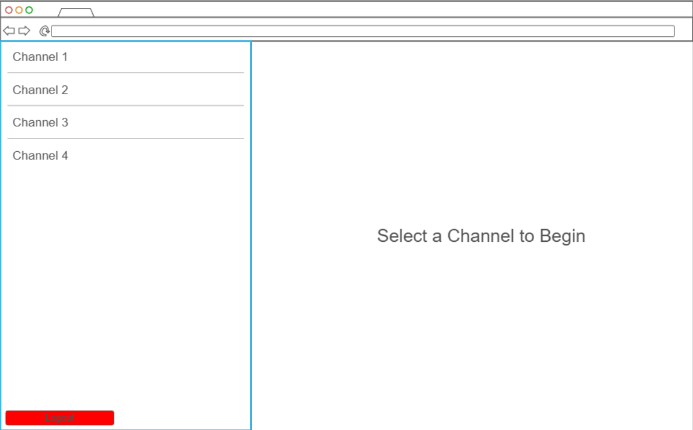
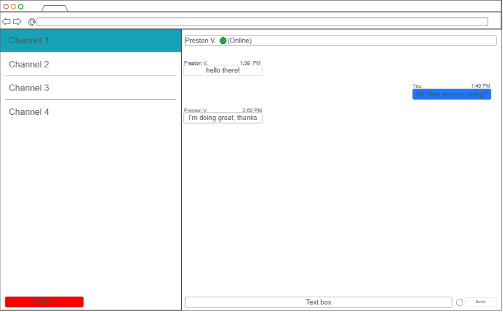
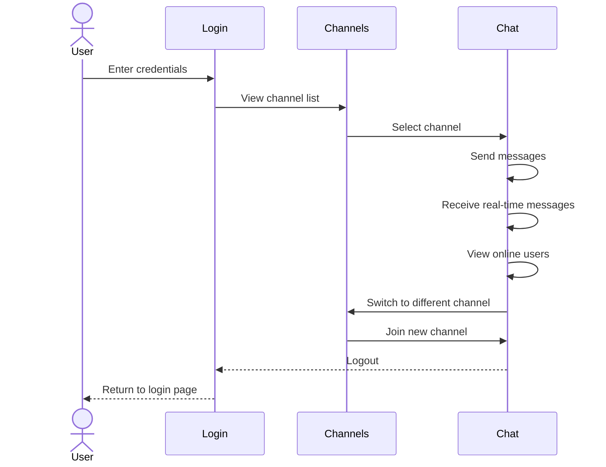

# Yapp

[My Notes](notes.md)

A brief description of the application here. Lorem ipsum dolor sit amet, consectetur adipiscing elit, sed do eiusmod tempor incididunt ut labore et dolore magna aliqua. Ut enim ad minim veniam, quis nostrud exercitation ullamco laboris nisi ut aliquip ex ea commodo consequat. Duis aute irure dolor in reprehenderit in voluptate velit esse cillum dolore eu fugiat nulla pariatur. Excepteur sint occaecat cupidatat non proident, sunt in culpa qui officia deserunt mollit anim id est laborum.

> [!NOTE]
> This is a template for your startup application. You must modify this `README.md` file for each phase of your development. You only need to fill in the section for each deliverable when that deliverable is submitted in Canvas. Without completing the section for a deliverable, the TA will not know what to look for when grading your submission. Feel free to add additional information to each deliverable description, but make sure you at least have the list of rubric items and a description of what you did for each item.

> [!NOTE]
> If you are not familiar with Markdown then you should review the [documentation](https://docs.github.com/en/get-started/writing-on-github/getting-started-with-writing-and-formatting-on-github/basic-writing-and-formatting-syntax) before continuing.

## 🚀 Specification Deliverable

For this deliverable I did the following. I checked the box `[x]` and added a description for things I completed.

- [x] Proper use of Markdown
- [x] A concise and compelling elevator pitch
- [x] Description of key features
- [x] Description of how you will use each technology
- [x] One or more rough sketches of your application. Images must be embedded in this file using Markdown image references.

### Elevator pitch

Communication is key to a successful team. With Yapp, sharing messages couldn't be easier. Join channels, start chatting, and see your team's activity in real-time, all in one simple platform.

### Design

### Key features

- User Login, Logout, Register
- Send a receive messages in a channel
- View previous messages
- View the online status of other users

### Technologies

I am going to use the required technologies in the following ways.

- **HTML** - 3 different views, Login/register, Channels, Messages
- **CSS** - Responsive design, clean user interface
- **React** - Interactive message sending, channel switching, routing between pages
- **Service** - REST API for auth, channels, message history, third-party call for a daily quote
- **DB/Login** - Store users, channels, messages
- **WebSocket** - Real-time message delivery, online status

## 🚀 AWS deliverable

For this deliverable I did the following. I checked the box `[x]` and added a description for things I completed.

- [x] **Server deployed and accessible with custom domain name** - [My server link](https://startup.pviloria.click).

## 🚀 HTML deliverable

For this deliverable I did the following. I checked the box `[x]` and added a description for things I completed.

- [x] **HTML pages** - 4 pages: login, register, about, channels.
- [x] **Proper HTML element usage** - I used different elements like body, input, articles, sections, etc.
- [x] **Links** - I have links that switch between different pages/views.
- [x] **Text** - Almost all pages have text, especially the about page.
- [x] **3rd party API placeholder** - About page has an "inspirational quote".
- [x] **Images** - I have an app logo on my about page.
- [x] **Login placeholder** - I have a login form that takes in a username and password.
- [x] **DB data placeholder** - I have place holder data that represents the different messages and times for each channel.
- [x] **WebSocket placeholder** - I have a place holder for the "status" data for a user and the real time message data.

## 🚀 CSS deliverable

For this deliverable I did the following. I checked the box `[x]` and added a description for things I completed.

- [x] **Header, footer, and main content body** - All content is formatted.
- [x] **Navigation elements** - Navigation elements are formatted.
- [x] **Responsive to window resizing** - Pages are responsive to resizing.
- [x] **Application elements** - Application elements are formatted.
- [x] **Application text content** - Application text content is formatted.
- [x] **Application images** - The Picture is formatted.

## 🚀 React part 1: Routing deliverable

For this deliverable I did the following. I checked the box `[x]` and added a description for things I completed.

- [x] **Bundled using Vite** - I have used vite in my project.
- [x] **Components** - I have made components for each page.
- [x] **Router** - I have used the router to switch between components.

## 🚀 React part 2: Reactivity deliverable

For this deliverable I did the following. I checked the box `[x]` and added a description for things I completed.

- [ ] **All functionality implemented or mocked out** - I did not complete this part of the deliverable.
- [ ] **Hooks** - I did not complete this part of the deliverable.

## 🚀 Service deliverable

For this deliverable I did the following. I checked the box `[x]` and added a description for things I completed.

- [ ] **Node.js/Express HTTP service** - I did not complete this part of the deliverable.
- [ ] **Static middleware for frontend** - I did not complete this part of the deliverable.
- [ ] **Calls to third party endpoints** - I did not complete this part of the deliverable.
- [ ] **Backend service endpoints** - I did not complete this part of the deliverable.
- [ ] **Frontend calls service endpoints** - I did not complete this part of the deliverable.
- [ ] **Supports registration, login, logout, and restricted endpoint** - I did not complete this part of the deliverable.

## 🚀 DB deliverable

For this deliverable I did the following. I checked the box `[x]` and added a description for things I completed.

- [ ] **Stores data in MongoDB** - I did not complete this part of the deliverable.
- [ ] **Stores credentials in MongoDB** - I did not complete this part of the deliverable.

## 🚀 WebSocket deliverable

For this deliverable I did the following. I checked the box `[x]` and added a description for things I completed.

- [ ] **Backend listens for WebSocket connection** - I did not complete this part of the deliverable.
- [ ] **Frontend makes WebSocket connection** - I did not complete this part of the deliverable.
- [ ] **Data sent over WebSocket connection** - I did not complete this part of the deliverable.
- [ ] **WebSocket data displayed** - I did not complete this part of the deliverable.
- [ ] **Application is fully functional** - I did not complete this part of the deliverable.
